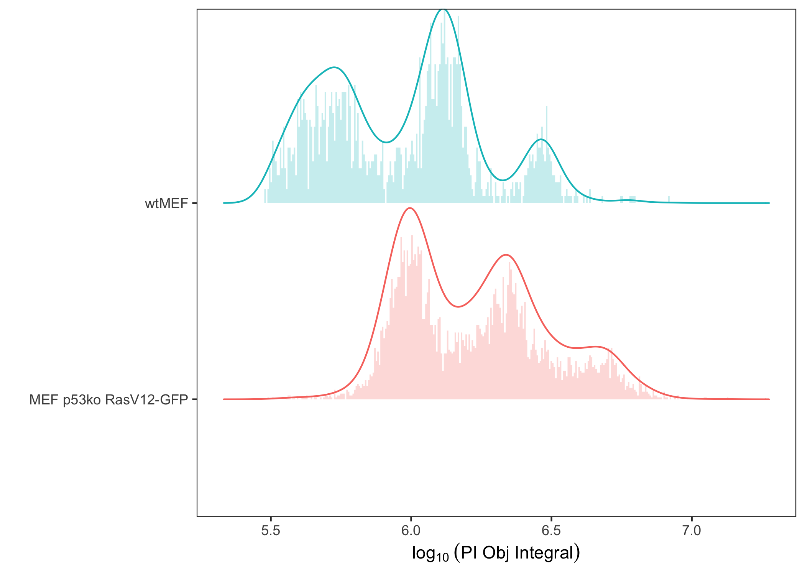

<!-- README.md is generated from README.Rmd. Please edit that file -->

# cellphaseR

<!-- badges: start -->
<!-- badges: end -->

cellphaseR is an R package for the analysis of cell cycle experiments
generated on the BioTek Cytation platform. It is primarily an
implementation of
[ggplot2](https://cran.r-project.org/web/packages/ggplot2/index.html)
and
[ggridges](https://cran.r-project.org/web/packages/ggridges/index.html)
packages for visualization and analysis of object level DNA content
measurements by propidium iodide (PI) staining. Although not tested
here, this package should be applicable to any other staining methods
that are indicative of relative DNA content.

## Installation

You can install the development version of cellphaseR as follows:

``` r
# install.packages("devtools")
devtools::install_github("HGWithers/cellphaseR")
```

## Example Dataset

An example dataset `PIdata` is provided with the package and contains
imaging data for PI stained cells from two different cell types:
wildtype (WT) mouse embryonic fibroblasts (wtMEF) or p53 knockout MEFs
transduced with HRas-V12-GFP oncogene.

``` r
## Load the library
library(cellphaseR)
#> Registered S3 methods overwritten by 'ggpp':
#>   method                  from   
#>   heightDetails.titleGrob ggplot2
#>   widthDetails.titleGrob  ggplot2

## View the example dataset
PIdata
#> # A tibble: 7,570 × 8
#>    Well  Cells `PI Obj Integral` `Object Index` `PI Obj Size` `PI Obj Area`
#>    <chr> <chr>             <dbl>          <dbl>         <dbl>         <dbl>
#>  1 D4    wtMEF            301821            154          12             101
#>  2 D4    wtMEF            544126            252          11.4           101
#>  3 D4    wtMEF            324017            524          11.6           101
#>  4 D4    wtMEF            319824            553          11.4           101
#>  5 D5    wtMEF            312154             58          12.1           101
#>  6 D5    wtMEF            677514            114          11.4           101
#>  7 D5    wtMEF            327071            139          11.7           101
#>  8 D5    wtMEF            497192            153          11.5           101
#>  9 D5    wtMEF            314237            175          11.6           101
#> 10 D5    wtMEF            322754            244          11.4           101
#> # ℹ 7,560 more rows
#> # ℹ 2 more variables: `PI Obj Mean` <dbl>, `PI Obj Peak` <dbl>
```

## Visualizing Cell Cycle Data

The `cpridges` function generates a log<sub>10</sub> histogram with
kernel density estimate overlay for your DNA content data. Here we use
the `PI Obj Integral` output value from the example `PIdata` to plot
cell cycle data by each cell type (`group = Cells`)

``` r
cpridges(data = PIdata, signal = `PI Obj Integral`, group = Cells)
#> Picking joint bandwidth of 0.049
```



### Customizing `cpridges`

The position of peaks can be labeled using the `label.peaks` argument of
`cpridges` and refined using the `peak.threshold` argument. Arguments
are also available to adjust histogram bins. Additional ggplot2
functions can be appended to `cpridges` for customization of plots.

``` r
cpridges(data = PIdata, signal = `PI Obj Integral`, group = Cells,
         label.peaks = TRUE, peak.threshold = 0) + ggplot2::labs(title = "Peak threshold = 0.1")
#> Picking joint bandwidth of 0.049
cpridges(data = PIdata, signal = `PI Obj Integral`, group = Cells,
         label.peaks = TRUE, peak.threshold = 0.1) + ggplot2::labs(title = "Peak threshold = 0.8")
#> Picking joint bandwidth of 0.049
```


### Extracting Peak Data

The `cpridges` function also allows you to extract the peak data as a
tibble using the `extract.peaks = TRUE` argument. This will return the
data instead of the ridge plot.

``` r
cpridges(data = PIdata, signal = `PI Obj Integral`, group = Cells,
         peak.threshold = 0.1, extract.peaks = TRUE)
#> # A tibble: 6 × 9
#>   Cells      `PI Obj Integral` density scaled ndensity  count     n peak  strict
#>   <chr>                  <dbl>   <dbl>  <dbl>    <dbl>  <dbl> <int> <lgl> <lgl> 
#> 1 MEF p53ko…              5.99   2.03   1        1     12037.  5937 TRUE  FALSE 
#> 2 MEF p53ko…              6.34   1.52   0.748    0.748  9008.  5937 TRUE  FALSE 
#> 3 MEF p53ko…              6.67   0.542  0.267    0.267  3219.  5937 TRUE  FALSE 
#> 4 wtMEF                   5.72   1.34   0.721    0.721  2181.  1633 TRUE  FALSE 
#> 5 wtMEF                   6.11   1.85   1        1      3026.  1633 TRUE  FALSE 
#> 6 wtMEF                   6.46   0.588  0.318    0.318   961.  1633 TRUE  FALSE
```
